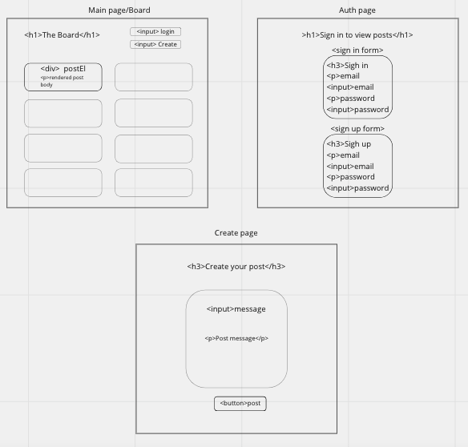

## The Golden Rule:

🦸 🦸‍♂️ `Stop starting and start finishing.` 🏁

If you work on more than one feature at a time, you are guaranteed to multiply your bugs and your anxiety.

## Making a plan

1. **Make a drawing of your app. Simple "wireframes"**
1. **Look at the drawing and name the HTML elements you'll need to realize your vision**
1. **Look at the drawing and imagine using the app. What _state_ do you need to track?**
1. **For each HTML element ask: Why do I need this? (i.e., "we need div to display the results in")**
1. **Once we know _why_ we need each element, think about how to implement the "Why" as a "How" (i.e., `resultsEl.textContent = newResults`)**
1. **Find all the 'events' (user clicks, form submit, on load etc) in your app. Ask one by one, "What happens when" for each of these events. Does any state change? Does any DOM update?**
1. **Think about how to validate each of your features according to a Definition of Done. (Hint: console.log usually helps here.)**
1. **Consider what features _depend_ on what other features. Use this dependency logic to figure out what order to complete tasks.**

Additional considerations:

-   Ask: which of your HTML elements need to be hard coded, and which need to be dynamically generated?
-   Consider your data model.
    -   What kinds of objects (i.e., Dogs, Friends, Todos, etc) will you need?
    -   What are the key/value pairs?
    -   What arrays might you need?
    -   What needs to live in a persistence layer?
-   Is there some state we need to initialize?
-   Ask: should any of this work be abstracted into functions? (i.e., is the work complicated? can it be reused?)

## home html

-login button - go to auth page - changes to logout when user is logged in
-create button - nav to create pg
2 empty divs for the cards

## home events

-   page load
    -   check if user logged in. if logged in, change to 'logout' buton
    -   Fetch, Loop, pass Object to Render, Append posts
-   click login button
    -   redirect to auth page (sign in page)
-   click log out button
    -   log user out, change text on button to login again
-   click create button
    -   redirect to create page

## data model

-   what is in a post?
    -   topic: string
    -   contact info: string
    -   message: string

## auth page

-   2 forms: sign in/up

## auth page events

-   on load, check if user is logged in, if so - redirect to home page
-   submit sign in form
    -   get user input from form (email/password)
    -   call signIn auth function w/ email/password
    -   redirect to home page
-   submit sign up form
    -   get user input from form (email/password)
    -   call signUp auth function w/ email/password
    -   redirect to home page

## create page

-   create post form

## events

-   on load if user is logged in- redirect to home page
-   on submit
    -   get data from form
    -   when user clicks figure out what they typed on click
    -   create post insupabase using form data
    -   redirect to home page so they will see the post
    - 

## slices

user should be able to:

-   see list of posts on load
-   go to auth page and log in
-   home page to indicate if user is logged in by changing button text to log in/out
-   user shouldnt be ale to go to create page if not logged in
-   user shouldnut be able to visit auth pg if logged in
-   logged in user hsould be ablet o visit create page and make post on submit
    -   sent ot home page on submit and post is there

need auth, create, and main pages!

-   auth.js and create.js and app.js
-   3 different HTML connected to their .js files

to switch to another page in event listener:

buttonElName.addeventlistener('click', () => {

    window.location.href = './nameOfOtherPage';

});
